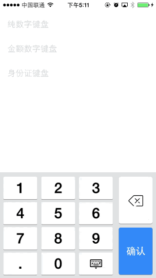

# BANumberKeyboard

模仿支付宝自定义数字键盘

BANumberKeyboard 是利用UITextFiled自定义一些常用的键盘，比如支持金额、纯数字（银行卡）、身份证。



### 如何使用BANumberKeyboard

1. 创建BATextFiled

```
numberTextField = [[BATextField alloc] initWithFrame:(CGRect){15,30,290,40}];
numberTextField.placeholder = @"纯数字键盘";
[self.view addSubview:numberTextField];
```    

2. 设置键盘类型


```
// 设置键盘为数字键盘
[numberTextField setKeyboardType:BAKeyboardTypeNumber];
```

3. 实现UITextFiled代理方法


### License

BANumberKeyboard is published under MIT License
